## 克隆代码库

`git@github.com:Facico/Chinese-Vicuna.git`

## 安装依赖

``` bash
# Python == 3.8
cd Chinese-Vicuna
pip install -r requirements.txt
```

## 下载数据集

  We have utilized several current high quality open source data and are very grateful for their contributions. Many of these data use chatgpt's interface like alpaca to generate high quality INSTRUCTION data.

        -   [Belle](https://github.com/LianjiaTech/BELLE)
        -   [guanaco](https://huggingface.co/datasets/JosephusCheung/GuanacoDataset)
    -   The data format is relatively simple, basically as follows, with simple examples such as：[`./sample/merge_sample.json`](https://github.com/Facico/Chinese-Vicuna/blob/master/sample/merge_sample.json)
        
        -   ```
            {
            'instruction': 
            'input': 
            'output'
            }
            ```
            
        -   That is, an instruction, an input, and an output are required. since the data is processed by directly linking instruction and input, the data can actually require only instruction and output, as
            
            ```
             {
              'instruction': "用一句话描述地球为什么是独一无二的。\\n\n"
              'input': ""
              'output': "地球上有适宜生命存在的条件和多样化的生命形式。"
              }
            ```
            
    -   The data we currently integrate is available for download on BaiduDownload or Google Drive or HuggingFace
        
        -   link: [https://pan.baidu.com/s/1WSxuhSAotl14ifaAiz5eKw?pwd=b4kb](https://pan.baidu.com/s/1WSxuhSAotl14ifaAiz5eKw?pwd=b4kb) password: b4kb
        -   link: [https://drive.google.com/file/d/1tzXVhS74m-EtoFot7hEc005LDeZGPit_/view?usp=sharing](https://drive.google.com/file/d/1tzXVhS74m-EtoFot7hEc005LDeZGPit_/view?usp=sharing)
        -   link: [https://huggingface.co/datasets/Chinese-Vicuna/guanaco_belle_merge_v1.0](https://huggingface.co/datasets/Chinese-Vicuna/guanaco_belle_merge_v1.0)
-   Large Language Model：
    
    -   LLAMA 7B（Of course, if you have a larger machine(such as 3090Ti) can be replaced with a 13B, LLAMA13B is numerically superior to 175B GPT3）
-   LORA model：
    
    -   We provide some lora models trained on the above mixed data,
        -   lora models
            -   50w data：[https://github.com/Facico/Chinese-Vicuna/tree/master/lora-Vicuna/checkpoint-4000](https://github.com/Facico/Chinese-Vicuna/tree/master/lora-Vicuna/checkpoint-4000)
            -   100w data（1.5 epoch）:  [https://github.com/Facico/Chinese-Vicuna/tree/master/lora-Vicuna/checkpoint-8000](https://github.com/Facico/Chinese-Vicuna/tree/master/lora-Vicuna/checkpoint-8000)
            -   all data（3 epoch）:  [https://github.com/Facico/Chinese-Vicuna/tree/master/lora-Vicuna/checkpoint-final](https://github.com/Facico/Chinese-Vicuna/tree/master/lora-Vicuna/checkpoint-final)
        -   You can also load our or other models from huggingface, load it by referring to [generate.py](https://github.com/Facico/Chinese-Vicuna/blob/master/generate.py)
            -   `Facico/Chinese-Vicuna-lora-7b-0.75epoch-belle-and-guanaco`
            -   `Facico/Chinese-Vicuna-lora-7b-1.5epoch-belle-and-guanaco`
            -   `Facico/Chinese-Vicuna-lora-7b-3epoch-belle-and-guanaco`
        -   The model uses 8bit+lora+256 tokens

## 运行微调

**Multi-gpu Training**

`bash finetune.sh`

-   The parameters to note here are as follows
    -   TOT_CUDA, fill in the GPU number to be used, such as `TOT_CUDA="0,1,2,3"`
    -   PORT, fill in the corresponding port
    -   DATA_PATH，fill in the corresponding data location in the format of json
    -   OUTPUT_PATH，fill in the relative path to save the model
    -   MODEL_PATH，path of LLM
    -   wandb：This is a training visualization tool that is not turned on by default in the script, and can be turned on by adding "--wandb" to the script

**Single-gpu Training**

```
python finetune.py --data_path merge.json --test_size 2000
```

-   The test_size cannot be larger than the data size

**inference and use gradio to generate a web page**

`bash generate.sh`

-   The parameters to note here are as follows
    
    -   BASE_MODEL，path of LLM
    -   LORA_PATH，The checkpoint folder of the lora model
        -   It should be noted here that the config loaded by the lora model must be "adapter_config.json" and the model name must be "adapter_model.bin", but it will be automatically saved as "pytorch_model.bin" during training. pytorch_model.bin" during training, while "adapter_config.json" and "adapter_model.bin" will be saved after all training is finished
            -   If you load the lora model in the training checkpoint, the code will automatically copy the local "config-sample/adapter_config.json" to the corresponding directory for you and rename the "pytorch_model.bin" to "adapter_model.bin". and rename "pytorch_model.bin" to "adapter_model.bin".
        -   It can also be any lora model on the huggingface corresponding to llama 7B, e.g.: `Facico/Chinese-Vicuna-lora-7b-3epoch-belle-and-guanaco`
    -   USE_LOCAL, which checks the local model configuration when set to 1
-   When using, "max_tokens" is set according to your computer's video memory, and if the generated content generates a lot of duplicate information, you can turn up the "Repetition Penalty".


## 微调实测

### 使用自己的数据

3 个 epoch 大概 18 个小时，占用大概 16G 内存，使用 7B LLaMA
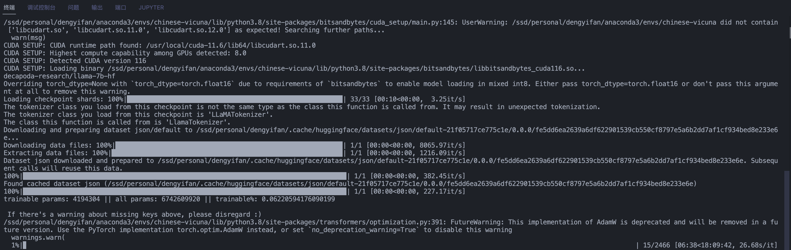

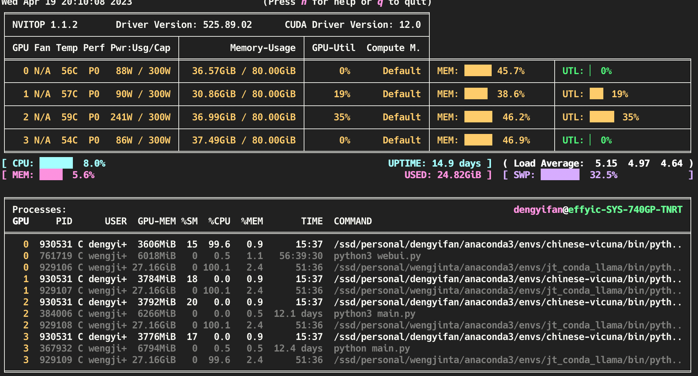

7B 模型 721 条数据  训练大概不到 20 分钟  10 Epoch  占用内存约 16G

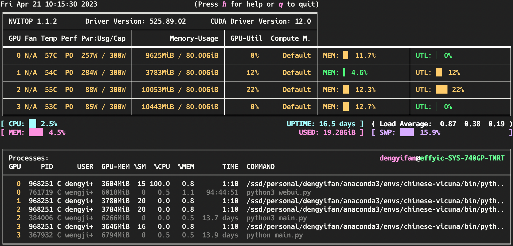

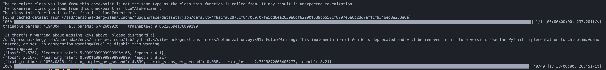

生成效果极差

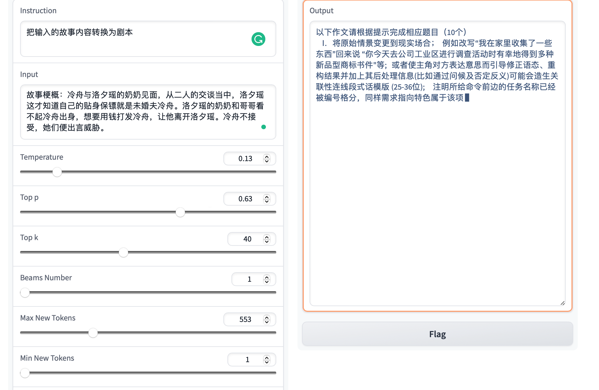
调整 beams

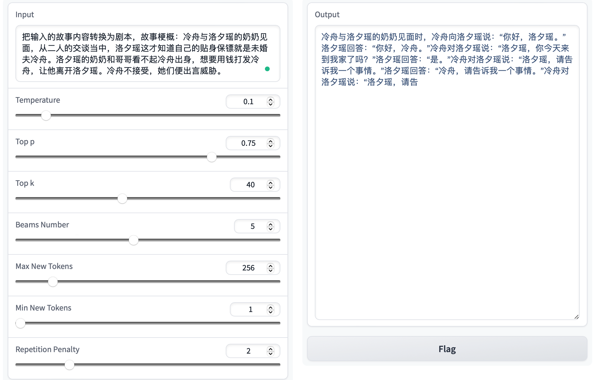


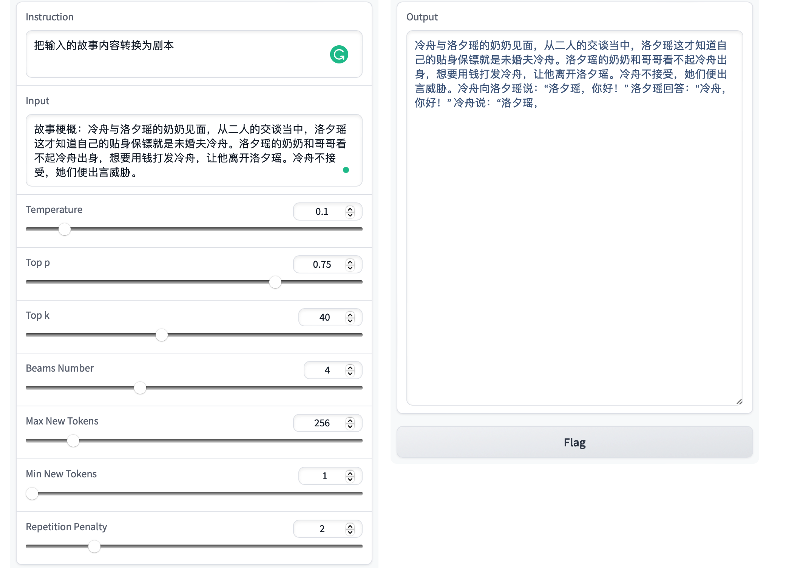


30B 模型 721 条数据  训练大概不到 60 分钟  10 Epoch  占用内存约 40 G

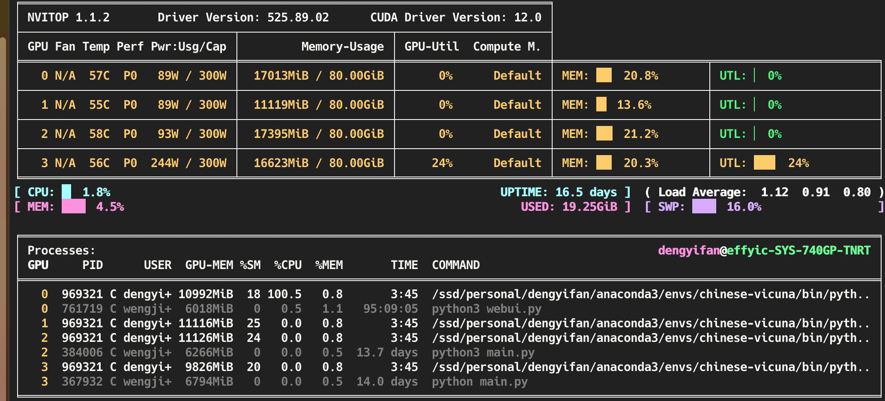

生成效果

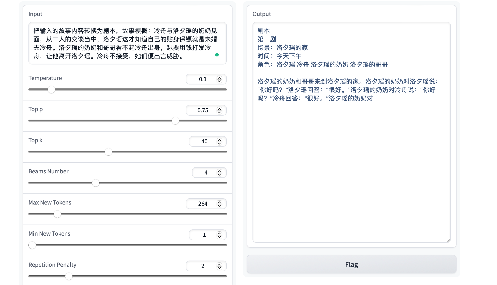


## 微调30B  423W 语料    2000 小时  3 epoch

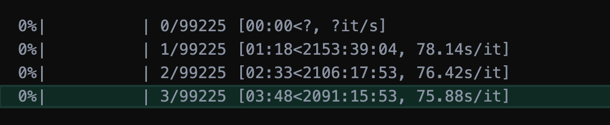


## 微调 7B merged_alpaca3

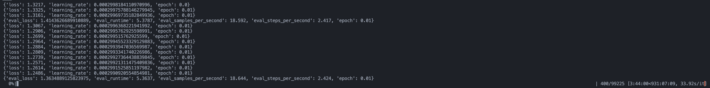

400step：
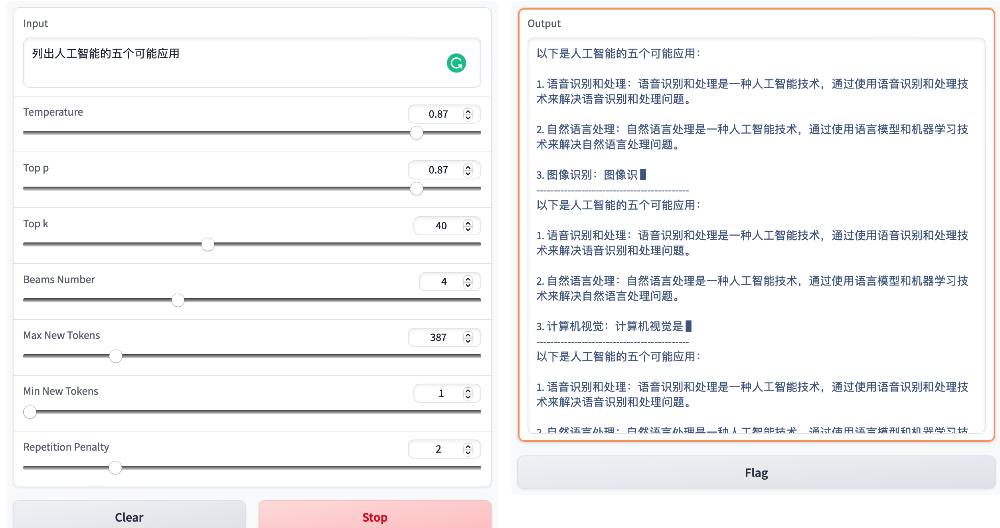

200 step：

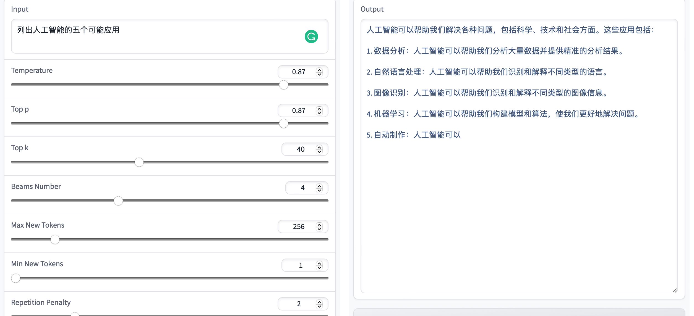


