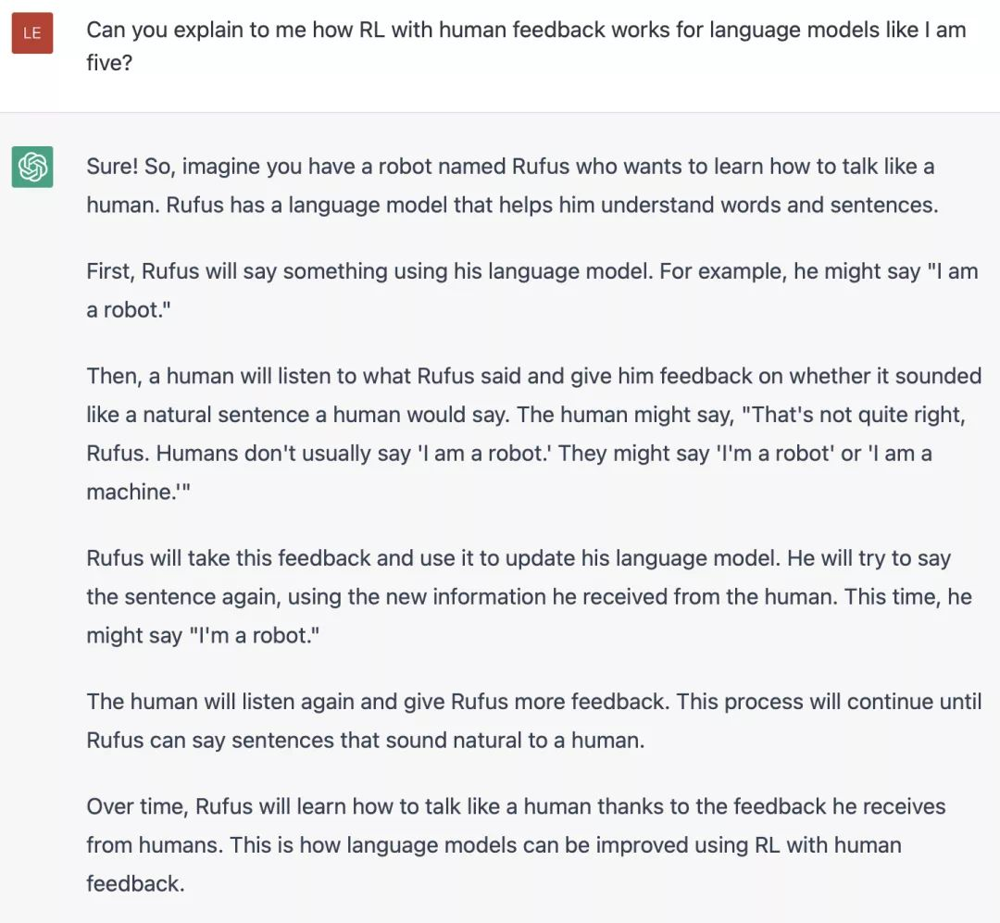
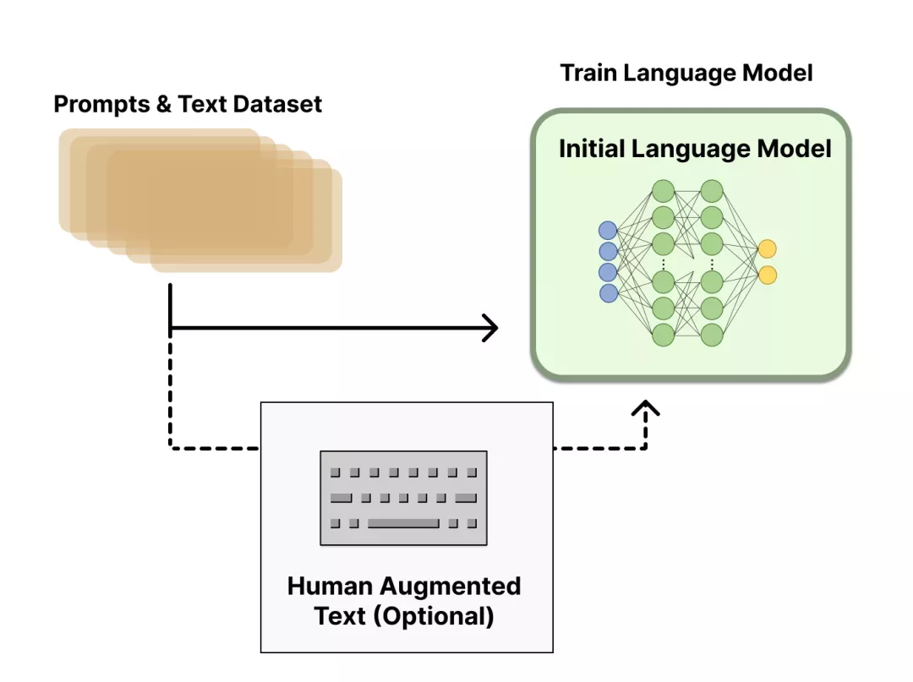
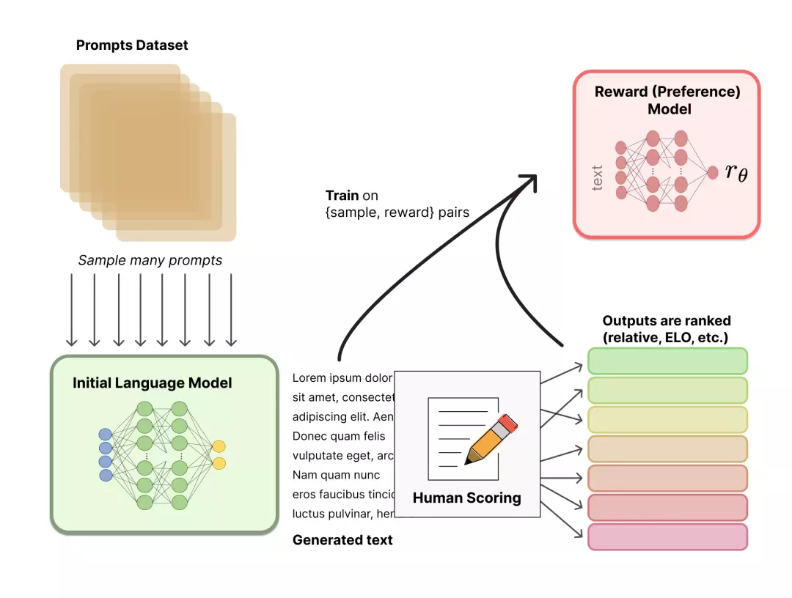
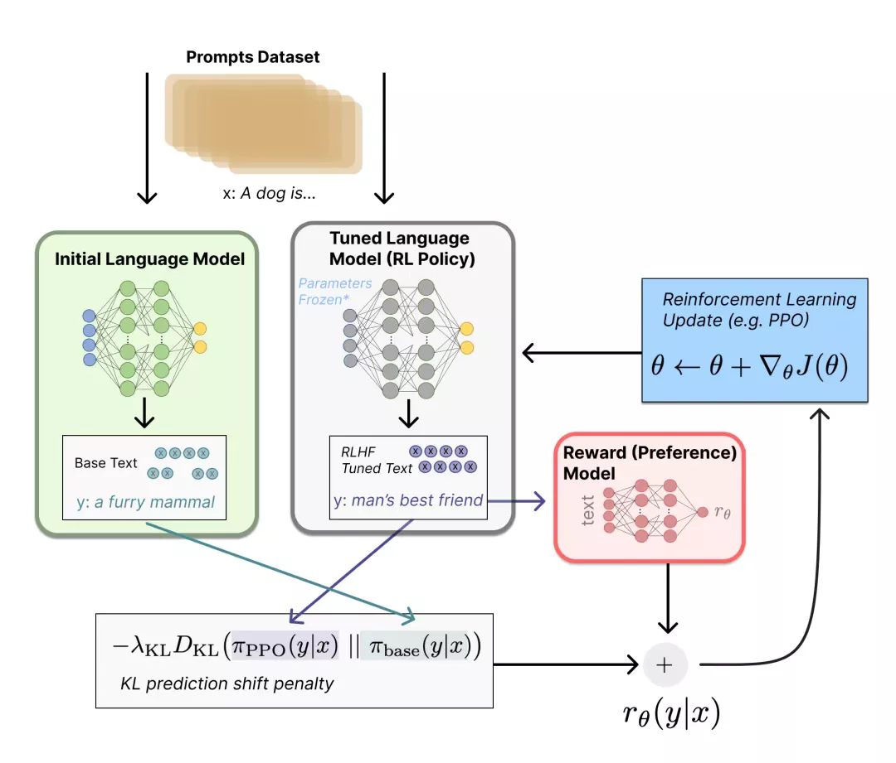

前几天，抱抱脸公司（HuggingFace）发表了一篇[博客](https://link.zhihu.com/?target=https%3A//huggingface.co/blog/rlhf)，详细讲解了ChatGPT背后的技术原理——RLHF。

在过去几年里，基于prompt范式的AI生成模型取得了巨大的成功，诞生了不少有意思的AI应用，例如AI写小说，AI写代码，AI画图甚至AI做视频等。

但其实这种生成模型很难训练。以语言模型为例，大多是采用“自回归生成”的方式，通过循环解码的方式来逐字或逐词生成内容。训练时往往简单的基于上下文信息去预测下一个词，然后用交叉熵来计算每个词的loss。显然这种token-level的loss不能很好的从整体输出的层面去指导模型优化方向。

为了能刻画模型输出的整体质量（而不是单个词），人们往往用BLEU或ROUGH等评价指标来刻画模型输出与人类偏好的相近程度，但这也仅仅是在评价的层面，模型在训练的时候是见不到这些人类真实的偏好的。

因此，训练阶段，如果直接用人的偏好（或者说人的反馈）来对模型整体的输出结果计算reward或loss，显然是要比上面传统的“给定上下文，预测下一个词”的损失函数合理的多。基于这个思想，便引出了本文要讨论的对象——**RLHF（Reinforcement Learning from Human Feedback）：即，使用强化学习的方法，利用人类反馈信号直接优化语言模型**。

RLHF也是最近大火的ChatGPT背后的训练方法。

ChatGPT的表现与以往的对话系统（或者聊天机器人）差异太大了，给大家留下了深刻的印象。下面就来详细讲解RLHF的技术原理。

## RLHF原理

RLHF的训练过程可以分解为三个核心步骤：

-   预训练语言模型（LM）
-   收集数据并训练奖励模型
-   通过强化学习微调 LM

首先，我们将了解第一步——预训练语言模型。

## 阶段1：预训练语言模型

首先，我们需要选一个经典的预训练语言模型作为初始模型。例如，OpenAI 在其第一个RLHF 模型 InstructGPT 中用的小规模参数版本的 GPT-3；DeepMind 则使用了2800 亿参数的 Gopher 模型。这些语言模型往往见过大量的 [Prompt,Text] 对，输入一个prompt（提示），模型往往能输出还不错的一段文本。

预训练模型可以在人工精心撰写的语料上进行微调，但这一步不是必要的。例如，OpenAI在人工撰写的优质语料上对预训练模型进行了微调；Anthropic将他们的语言模型在“有用、真实、无害”价值观导向的语料上做了一步模型蒸馏。不过，这种人工撰写的优质语料一般成本是非常高的。

总结一下，这个步骤，可以用如下图所示：

此外，到底哪个预训练模型版本是RLHF热启的最优选择？这其实没有一个定论，仍是一个开放问题。

再之后，我们需要基于这个初始语言模型产出的数据来训练一个 **奖励模型（reward model，简称RM）**。接下来，就会引入人类的反馈信号了。

## 阶段2：奖励模型的训练

一个奖励模型（RM）的目标是刻画模型的输出是否在人类看来表现不错。即，输入 [提示(prompt)，模型生成的文本] ，输出一个刻画文本质量的标量数字。

用于训练奖励模型的Prompt数据一般来自于一个预先富集的数据集，比如Anthropic的Prompt数据主要来自Amazon Mechanical Turk上面的一个聊天工具；OpenAI的Prompt数据则主要来自那些调用GPT API的用户。这些prompts会被丢进初始的语言模型（第一阶段的模型）里来生成文本。

整体流程如图所示：

奖励模型可以看做一个判别式的语言模型，因此我们可以用一个预训练语言模型热启，而后在 [x=[prompt，模型回答], y=人类满意度] 构成的标注语料上去微调，也可以直接随机初始化，在语料上直接训练。

如上图所示，标注人员的任务则是对初始语言模型生成的文本进行排序。有人可能会奇怪，为啥不直接让标注人员对文本进行打分呢？

这是因为研究人员发现不同的标注员，打分的偏好会有很大的差异（比如同样一段精彩的文本，有人认为可以打1.0，但有人认为只能打0.8），而这种差异就会导致出现大量的噪声样本。若改成标注排序，则发现不同的标注员的打分一致性就大大提升了。

那具体怎么操作呢？一种比较有效的做法是“pair-wise”，即给定同一个prompt，让两个语言模型同时生成文本，然后比较这两段文本哪个好。最终，这些不同的排序结果会通过某种归一化的方式变成标量信号（即point-wise）丢给模型训练。

一个比较有趣的观测是，奖励模型的大小最好是跟生成模型的大小相近，这样效果会比较好。一种比较直观的解释就是，要理解生成模型的输出内容，这份理解能力所需要的模型参数规模就得恰好是跟生成模型相近才能做到（当然，如果奖励模型规模更大那应该更没问题，但理论上没必要）。

至此，我们有了一个初始的语言模型来生成文本，以及一个奖励模型（RM）来判断模型生成的文本是否优质（迎合人类偏好）。接下来会讲解如何使用强化学习(RL)来基于奖励模型来优化初始的语言模型。

## 阶段3：基于 RL 进行语言模型优化

我们将初始语言模型的微调任务建模为强化学习（RL）问题，因此需要定义策略（policy）、动作空间（action space）和奖励函数（reward function）等基本要素。

显然，策略就是基于该语言模型，接收prompt作为输入，然后输出一系列文本（或文本的概率分布）；而动作空间就是词表所有token在所有输出位置的排列组合（单个位置通常有50k左右的token候选）；观察空间则是可能的输入token序列（即prompt），显然也相当大，为词表所有token在所有输入位置的排列组合；而奖励函数（reward）则是基于上一章节我们训好的RM模型计算得到初始reward，再叠加上一个约束项来。

然后我们来看一下最后提到的这个约束项是什么。

首先，基于前面提到的预先富集的数据，从里面采样prompt输入，同时丢给初始的语言模型和我们当前训练中的语言模型（policy），得到俩模型的输出文本y1，y2。然后用奖励模型RM对y1、y2打分，判断谁更优秀。显然，打分的差值便可以作为训练策略模型参数的信号，这个信号一般通过KL散度来计算“奖励/惩罚”的大小。显然，y2文本的打分比y1高的越多，奖励就越大，反之惩罚则越大。这个信号就反映了当前模型有没有在围着初始模型“绕圈”，避免模型通过一些“取巧”的方式骗过RM模型获取高额reward。

最后，便是根据 Proximal Policy Optimization (PPO) 算法来更新模型参数了。

该阶段流程如下图所示：

通过以上过程不难想到，完全可以迭代式的更新奖励模型（RM）和策略模型（policy），让奖励模型对模型输出质量的刻画愈加精确，策略模型的输出则愈能与初始模型拉开差距，使得输出文本变得越来越符合人的认知。Anthropic就曾经在论文里讨论了这种做法，并命名为 "Iterated Online RLHF" ，感兴趣的小伙伴可以看下面这篇论文，这里就不展开了：

_[https://arxiv.org/abs/2204.05862](https://link.zhihu.com/?target=https%3A//arxiv.org/abs/2204.05862)_

# RLHF 的下一步是什么？

收集人类偏好数据的质量和数量决定了 RLHF 系统性能的上限。==RLHF 系统需要两种人类偏好数据：人工生成的文本和对模型输出的偏好标签==。生成高质量回答需要雇佣兼职人员 (而不能依赖产品用户和众包) 。另一方面，==训练 RM 需要的奖励标签规模大概是 50k== 左右，所以并不那么昂贵 (当然远超了学术实验室的预算) 。目前相关的数据集只有一个基于通用 LM 的 RLHF 数据集 (来自 Anthropic) 和几个较小的子任务数据集 (如来自 OpenAI 的摘要数据集) 。另一个挑战来自标注者的偏见。几个人类标注者可能有不同意见，导致了训练数据存在一些潜在差异。

虽然ChatGPT为代表的RLHF技术非常有影响力，引发了巨大的关注，但仍然存在若干局限性：

1.  RLHF 范式训练出来的这些模型虽然效果更好，但仍然可能输出有害或事实上不准确的文本。这种不完美则是 RLHF 的长期挑战和优化目标。
2.  在基于 RLHF 范式训练模型时，人工标注的成本是非常高昂的，而 RLHF 性能最终仅能达到标注人员的知识水平。此外，这里的人工标注主要是为RM模型标注输出文本的排序结果，而若想要用人工去撰写答案的方式来训练模型，那成本更是不可想象的。
3.  RLHF的流程还有很多值得改进的地方，其中，改进 RL 优化器显得尤为重要。PPO 是一种基于信赖域优化的相对较旧的RL算法，但没有其他更好的算法来优化 RLHF 了。

# 延伸阅读 —— RLHF论文列表

-   Deep Reinforcement Learning from Human Preferences (Christiano et al. 2017): RLHF applied on preferences between Atari trajectories.
-   Fine-Tuning Language Models from Human Preferences (Zieglar et al. 2019): An early paper that studies the impact of reward learning on four specific tasks.
-   Learning to summarize with human feedback (Stiennon et al., 2020): RLHF applied to the task of summarizing text. Also, Recursively Summarizing Books with Human Feedback (OpenAI Alignment Team 2021), follow on work summarizing books.
-   WebGPT: Browser-assisted question-answering with human feedback (OpenAI, 2021): Using RLHF to train an agent to navigate the web.
-   InstructGPT: Training language models to follow instructions with human feedback (OpenAI Alignment Team 2022): RLHF applied to a general language model [Blog post on InstructGPT].
-   GopherCite: Teaching language models to support answers with verified quotes (Menick et al. 2022): Train a LM with RLHF to return answers with specific citations.
-   Sparrow: Improving alignment of dialogue agents via targeted human judgements (Glaese et al. 2022): Fine-tuning a dialogue agent with RLHF
-   ChatGPT: Optimizing Language Models for Dialogue (OpenAI 2022): Training a LM with RLHF for suitable use as an all-purpose chat bot.
-   Scaling Laws for Reward Model Overoptimization (Gao et al. 2022): studies the scaling properties of the learned preference model in RLHF.
-   Training a Helpful and Harmless Assistant with Reinforcement Learning from Human Feedback (Anthropic, 2022): A detailed documentation of training a LM assistant with RLHF.
-   Red Teaming Language Models to Reduce Harms: Methods, Scaling Behaviors, and Lessons Learned (Ganguli et al. 2022): A detailed documentation of efforts to “discover, measure, and attempt to reduce [language models] potentially harmful outputs.”
-   Dynamic Planning in Open-Ended Dialogue using Reinforcement Learning (Cohen at al. 2022): Using RL to enhance the conversational skill of an open-ended dialogue agent.