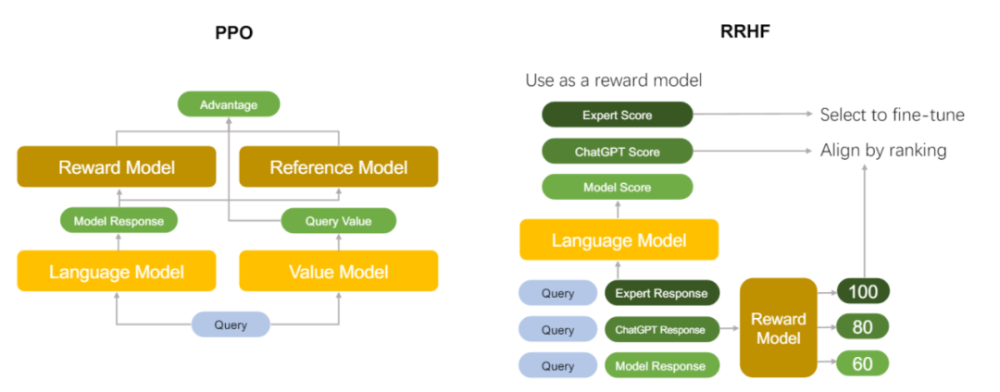
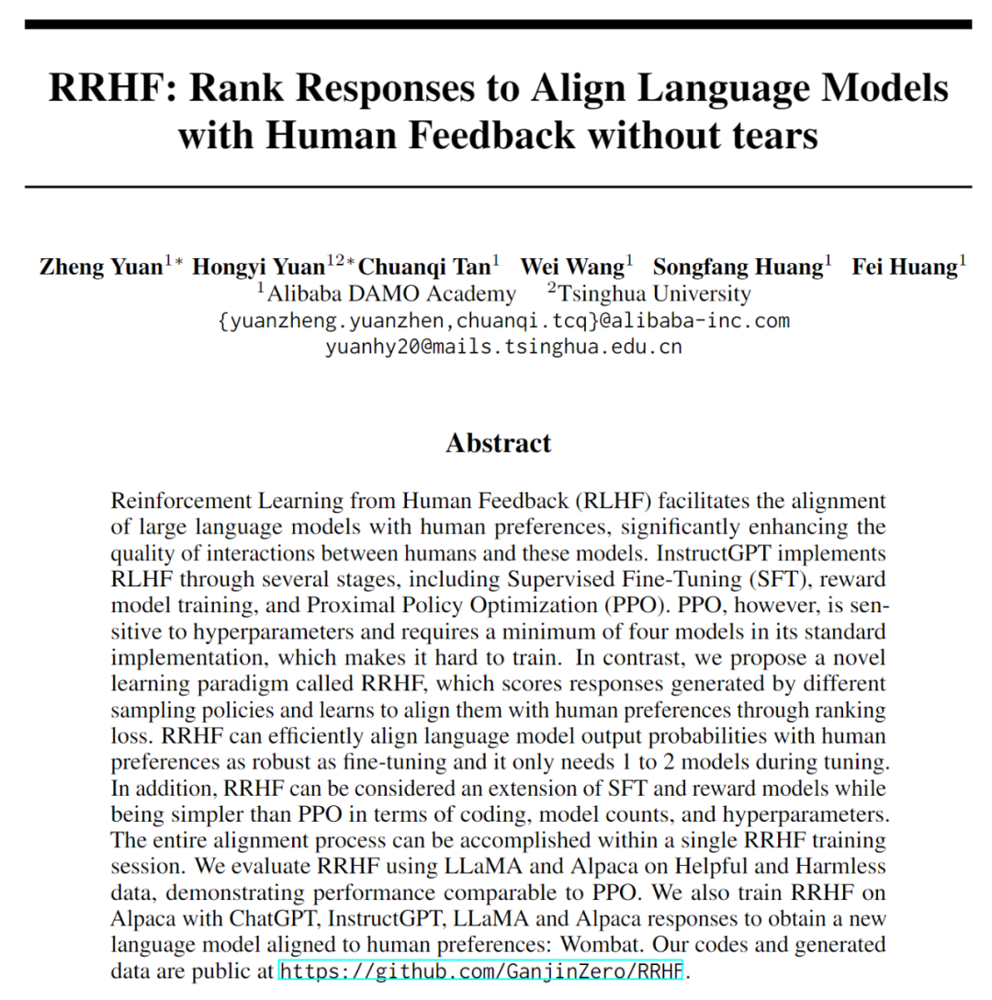

# 无需强化学习的与人类偏好对齐的语言模型：Wombat袋熊
  

  

  

OpenAI 的 ChatGPT 理解多种多样的的人类指令，并且可以很好的应对不同的语言任务需求。自发布以来就掀起了对于通用人工智能的讨论。ChatGPT 令人惊叹的能力来源于一种新颖的大规模语言模型微调方法：RLHF（通过强化学习对齐人类反馈）。

  

RLHF 方法不同于以往传统的监督学习的微调方式，该方法首先让模型根据指令提示生成不同的回复，之后通过人工的评价反馈，使用强化学习的方式对 LLM 进行微调。RLHF 解锁了语言模型跟从人类指令的能力，并且使得语言模型的能力和人类的需求和价值观对齐，从而使得 RLHF 微调下的语言模型具有令人惊叹的能力。 

  

当前研究 RLHF 的工作主要使用 PPO 算法对语言模型进行优化。从一个使用指令和人类示范的数据通过监督学习微调的语言模型开始，PPO 算法首先使用这个语言模型输出对于不同指令数据的回复，之后通过一个奖励模型对语言模型的不同回复进行打分评价，最后使用打分评价通过策略梯度下降的方式对语言模型进行优化。

  

考虑到语言模型在训练中不断变化和奖励模型有限的泛化能力，PPO 在工程实践中需要反复迭代上述流程，并且在奖励的设计上需要限制微调的语言模型不能偏离初始模型太远。由于使用强化学习训练包含有众多的超参数，并且在算法迭代的过程中需要多个独立模型的相互配合，错误的实现细节都会导致不尽如人意的训练结果。 

  

在和人类对齐的角度上，强化学习算法是不是必须的呢？该篇论文提出了**基于排序的人类偏好对齐方法**。它对不同语言模型生成的回复（回复可以来自 ChatGPT、GPT-4、当前的训练模型或者人类标注数据）进行评分，评分来自于回复在当前模型下的对数概率。RRHF 通过通过排名损失使评分与人类的偏好（或者代理的奖励模型）对齐。RRHF 训练好的模型可以同时作为生成语言模型和奖励模型使用。下图中对比了 PPO 算法和 RRHF 算法的区别。

  

RRHF 算法可以有效地将语言模型输出概率与人类偏好对齐，并且在微调期间只需要 1 到 2 个模型。相比之下，PPO 需要 4 个模型：微调的语言模型，参考语言模型，奖励模型和价值模型相互配合。在实际的训练中，更少的模型数量可以帮助减少显存的占用，使得 RRHF 可以更高效地利用计算资源，并扩展到更大规模的模型上进行训练。

此外，RRHF 在编码和超参数方面比 PPO 更简单。整个对齐过程（包括监督学习、训练奖励模型、进行 PPO）可以在一次 RRHF 训练中完成。文章在 Anthropic 发布的 Helpful and Harmless 数据上使用 Meta 的 LLaMA 和斯坦福的 Alpaca 模型进行实验，发现 RRHF 可以达到和 PPO 相当的水平。在代码实践上，RRHF 和传统的监督学习微调算法的难易程度相当，极大地减小了语言模型和人类偏好对齐的工程难度。 

同时，文章作者基于 RRHF 算法，使用 Alpaca 的提示数据并利用 ChatGPT 或者 GPT-4 作为得分模型，训练了语言模型 Wombat-7B 和 Wombat-7B-GPT4。训练时间只需要几个小时。训练得到的袋熊 Wombat‍ 可以更好的与人类偏好对齐。以下是来自袋熊 Wombat‍ 的一个自我介绍。

Query: Give an introduction of wombat 

  

Wombat: Wombat is a marsupial mammal native to Australia. It is typically found in mountainous areas and is known for its burrowing behavior. Wombats are typically around two feet long and weigh up to 30 pounds. They have a gray coat with white on their chests, and they have thick and powerful hind legs which they use for digging. Wombats are mostly nocturnal and eat a variety of insects, leaves, and grasses.

  

  

  

**论文链接：**  

https://arxiv.org/abs/2304.05302

**作者单位：**  

阿里巴巴达摩院

**代码链接：**

https://github.com/GanjinZero/RRHF